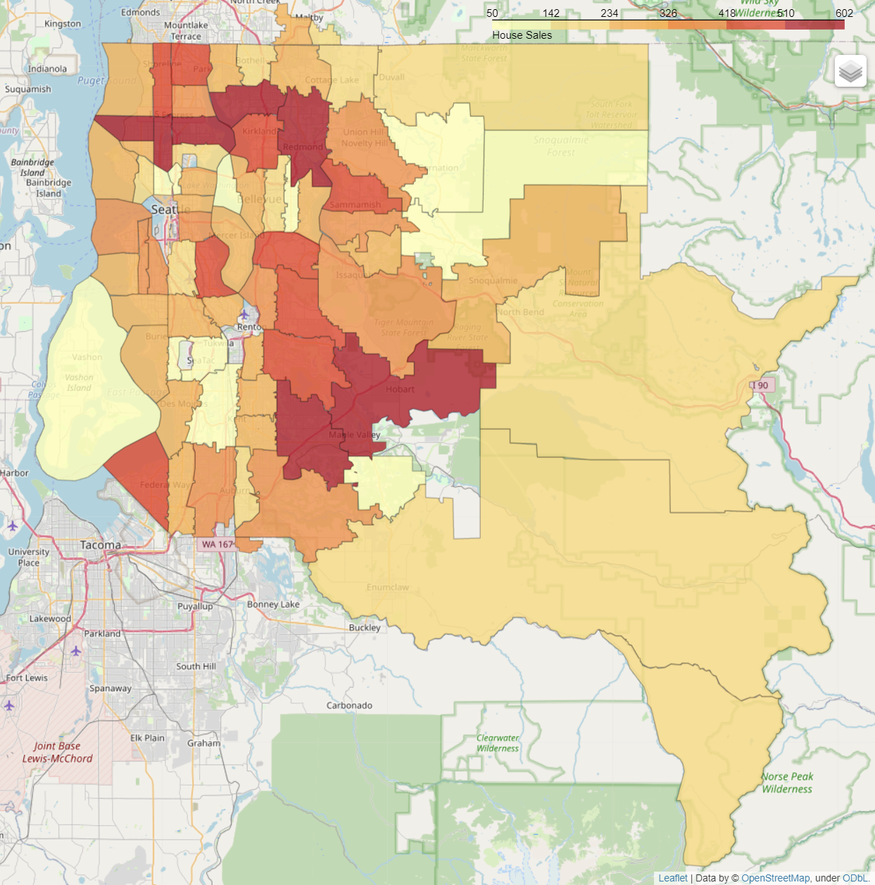
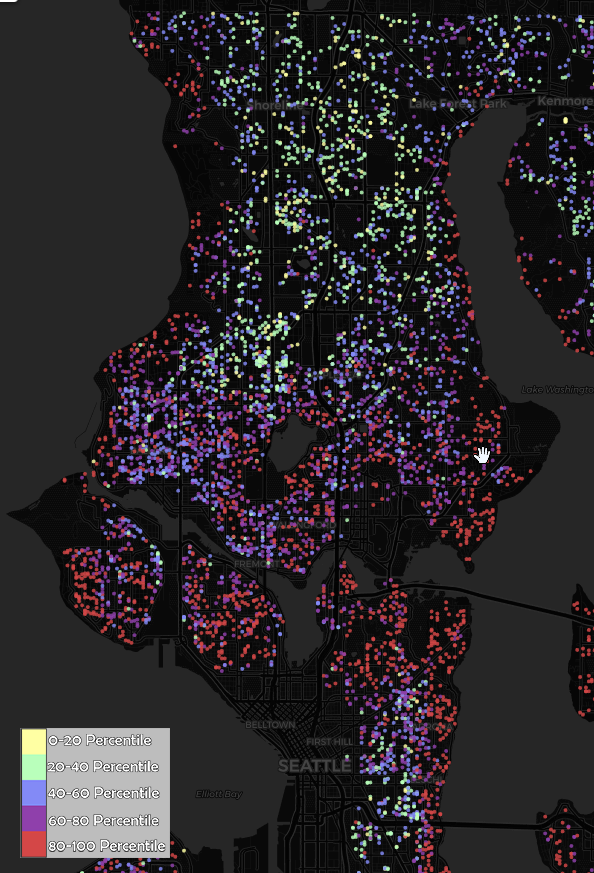
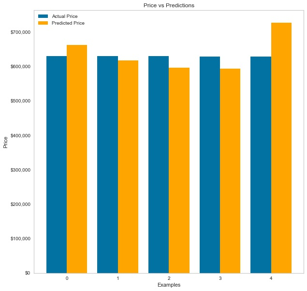

# Machine Learning in the county of Kings


## Business Problem
---
Our chosen stakeholder is the real-estate agency Keller Williams, who's looking to expand into King County in Washington. They want an analytically supported strategy based on inferential and predictive analysis of the data available on the king county website. Our approach to formulating the business question was to first define our recommended strategy and formulate the business question around it. Accordingly, we formulated three questions that we wanted to answer using our data analysis and based our recommendations on those questions.

We defined our strategy based on the volume metrics of the data and determined that the best way moving forward is to target sellers and buyers of houses that are in highest demand. We chose this strategy because we felt this approach would maximize your future potential revenue. This is based on the notion that a higher quantity of sales would result in more revenues than higher-value sales.

Given our recommended strategy, the business question we formulated is :
What types of houses are in most demand and where are they located?

## Data
---
The data that we used originally came from the King County website, which describes a years worth of sales information starting from May 2014 to May 2015. It contains a good mix of categorical and numerical data. We wanted to focus on variables that corresponded to features that determine the demand of any given house.

Boundary and mapping data was sourced from [https://gis-kingcounty.opendata](https://gis-kingcounty.opendata.arcgis.com/datasets/zipcodes-for-king-county-and-surrounding-area-shorelines-zipcode-shore-area/explore), a repository of publicly available datsets.


## Methodology
---
Python libraries pandas, numpy were used for working with the data, sklearn was our primary modeling tool, and folium was used as a mapping visualizer.

Our approach to data preparation was systematic. We removed some extraneous outliers that would skew our model, dropped columns that that didn't have enough data to incorporate into our model and didn't speak to our business problem. In the end, our model leveraged:
-   ZIP Code used by the United States Postal Service
-   Year when house was built
-   Square footage of living space in the home
-   The square footage of interior housing living space for the nearest 15 neighbors
-   Number of bedrooms and bathrooms
-   Quality of view from the property


To speak directly to our original business question, 
>What types of houses are in most demand and where are they located?

Location as a feature is key. Looking at the data in conjunction with zipcode boundary information we can highlight areas around King County that are in demand.



There are a few zipcodes that have a high volume of listings, however the areas around Green Lake really stand out considering the size of these districts. Most of these zipcodes have over 500 listings in that year alone.

Looking at how properties are priced we can deduce the market demands in a region. Focusing on Green Lake we see that aside from being in demand, homes surrounding it are generally are in the mid to high range.



In fact, per our dataset, the median home price in King County is 450,000$. In comparison, the median price of properties in the surrounding areas is around 550,000$.

>>>Next we can identify property features that drive price.



## Conclusions
---
In conclusion, the answers to the questions above translates into actionable recommendations. The zip codes which have sold the most homes are the zip codes we recommend targeting in terms of sellers. Similarly with the features of the home, such as bedroom etc. We recommend targeting sellers that have these features in their homes. We recommend using our model to input these values to predict what price the house will ultimately sell for, thereby also predicting future potential revenue.

## Next steps
---
For Next Steps, if we gather more first-party data we can analyze the potential costs of our recommended strategy and provide a more holistic overview of our current model. With more historical data we can upgrade our model to include time series analysis which will formulate more accurate predictions and also illustrate both sales and price trends throughout the year, which would be invaluable to Keller Williams Realty moving forward. Furthermore, we can use the upgraded model to determine whether the housing market is over or under-inflated at any given time. This would be a great predictive tool in understanding whether to gear marketing efforts to sellers or buyers and vice versa.

## Repository Structure
---
```
├── Workspace  
│     ├── Nimeshi
│     │   ├── Notes.md
│     │   └── Untitled.ipynb
│     ├── Saad
│     │   ├── FoliumChoropleth.ipynb
│     │   ├── FoliumMarkers.ipynb
│     │   ├── Notebook.ipynb
│     │   ├── Notebook_obsolete.pynb
│     │   └── Notes.md
│     └── Zach
│          ├── Models 6-8.ipynb
│          ├── Refined Analysis.ipynb
│          ├── Scrapwork.ipynb
│          ├── Scrapwork2.ipynb
│          └── Notes.md
│
├── data
│     ├── column_names.md
│     ├── kc_house_data.csv
│     └── Zipcodes_for_King_County_and_Surrounding_Area___zipcode_area.geojson
├── images
├── maps
│     ├── PropertiesPentileDisplay.html
│     └── choropeth_zip_salecounts.html
├── README.md
├── *Final Presentation*
└── Price_Prediction_and_Analysis_in_KingCounty.ipynb
```


## Authors:
---
- Nimeshi Fernando: 
[LinkedIn](https://www.linkedin.com/in/nimeshi-fernando2019/) |
[GitHub](https://github.com/nishlikefish) |
[Email](nimeshilfernando@gmail.com)
- Saad Saeed: 
[LinkedIn](https://www.linkedin.com/in/saadsaeed85/) |
[GitHub](https://github.com/ssaeed85) |
[Email](mailto:saadsaeed85@gmail.com)
- Zachary Rauch: 
[LinkedIn](https://www.linkedin.com/in/zach-rauch/) |
[GitHub](https://github.com/ZachRauch)|
[Email](zach.rauch0@gmail.com)
Our model and analysis can be found at our github repo:[Price Prediction and Analysis in KingCounty](https://github.com/ssaeed85/dsc-ph2-KingsCountyRealEstate)

## Citations:
---
Images and logo of King County are properties of [kingcounty.gov](https://kingcounty.gov/) \
Zipcode geoJSON: [gis-kingcounty.opendata](https://gis-kingcounty.opendata.arcgis.com/datasets/zipcodes-for-king-county-and-surrounding-area-shorelines-zipcode-shore-area/explore) 

Folium References:\
[python-visualization.github](https://python-visualization.github.io/folium/quickstart.html) \
[towardsdatascience.com/visualizing-data-at-the-zip-code-level-with-folium](https://towardsdatascience.com/visualizing-data-at-the-zip-code-level-with-folium-d07ac983db20) \
[towardsdatascience.com/how-to-step-up-your-folium-choropleth-map-skills](https://towardsdatascience.com/how-to-step-up-your-folium-choropleth-map-skills-17cf6de7c6fe) \
[towardsdatascience.com/folium-and-choropleth-map-from-zero-to-pro](https://towardsdatascience.com/folium-and-choropleth-map-from-zero-to-pro-6127f9e68564) \
[write-geojson-into-a-geojson-file-with-python](https://gis.stackexchange.com/questions/130963/write-geojson-into-a-geojson-file-with-python) 
